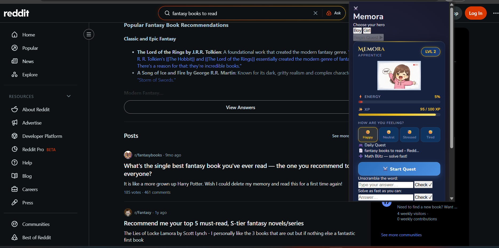
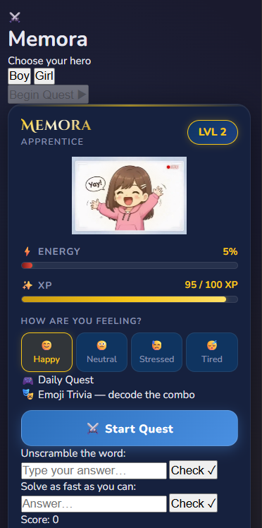
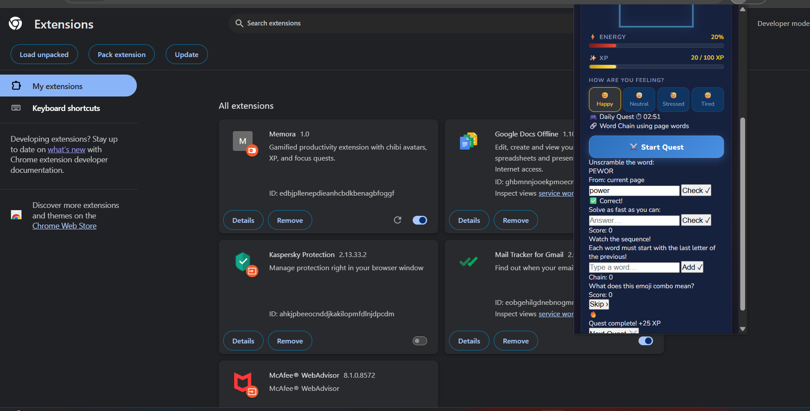

<p align="center">
  
</p>

# Memora 🎯

## Basic Details

### Team Name: Ravens

### Team Members
- Member 1: Neha Fathima B - Sree Buddha College of Engineering, Pattoor
- Member 2: Alina Elizabeth Biju - Sree Buddha College of Engineering, Pattoor

### Project Description
Memora is a Chrome extension that gamifies productivity by giving you a personalised chibi avatar that reacts to your mood and levels up as you work. It replaces mindless browsing with fun mini-games — word puzzles, math blitzes, memory challenges — sourced directly from the page you're on. Stay focused, earn XP, unlock new characters, and turn every study session into an adventure.

### The Problem statement
[Students constantly lose focus while browsing — existing productivity tools are easy to dismiss because there's no emotional connection or real incentive to stay on task.Without something that feels personal and rewarding, reminders get ignored, guilt sets in after distraction, and the cycle repeats with no meaningful way to break it.]

### The Solution
[Memora solves this by turning your browser into an RPG — pairing a personalised chibi avatar that reacts to your mood in real-time with a quest system that challenges you with mini-games built from the content of the page you're actually studying. Every focused session earns XP, unlocks new character tiers, and makes productivity feel less like a chore and more like levelling up.]

---

## Technical Details

### Technologies/Components Used

**For Software:**
- Languages used: [e.g., JavaScript, Python, Java]
- Frameworks used: [e.g., React, Django, Spring Boot]
- Libraries used: [e.g., axios, pandas, JUnit]
- Tools used: [e.g., VS Code, Git, Docker]

---

## Features

List the key features of your project:
- Feature 1: [Mood-Reactive Chibi Avatar]
- Feature 2: [Page-Aware Mini-Game Quests ]
- Feature 3: [XP & Level-Up System]
- Feature 4: [Persistent Progress]

---

## Implementation

### For Software:

#### Installation
```bash
[Installation commands - e.g., npm install, pip install -r requirements.txt]
```

#### Run
```bash
[Run commands - e.g., npm start, python app.py]
```

## Project Documentation

### For Software:

#### Screenshots (Add at least 3)


*Add caption explaining what this shows*


*Add caption explaining what this shows*


*Add caption explaining what this shows*

---

## Team Contributions

- Neha Fathima B: Specific contributions - Design, UX, Asset, Game Planner.
- Alina Elizabeth Biju: Specific contributions - Extension setup, Game logic, Debugging.

---

## License

This project is licensed under the [MIT] License - see the [LICENSE](LICENSE) file for details.

---

Made with ❤️ at TinkerHub
